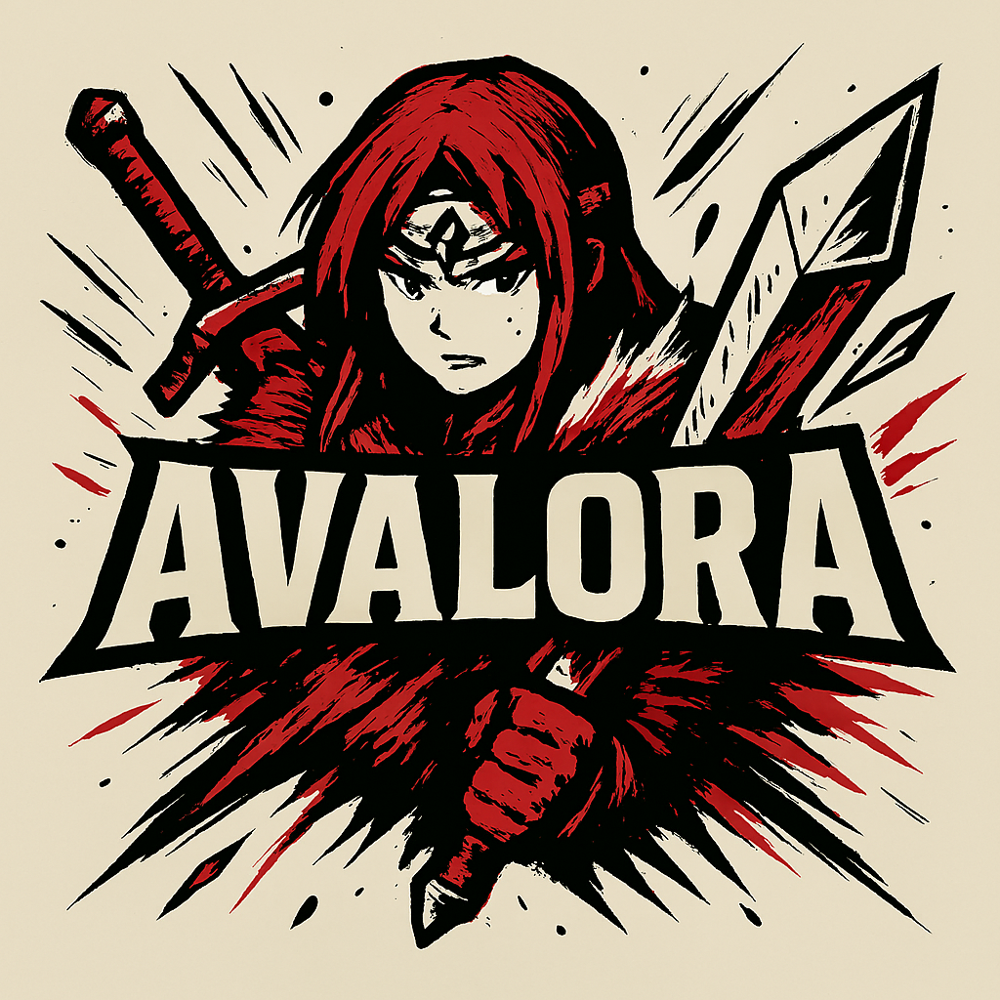
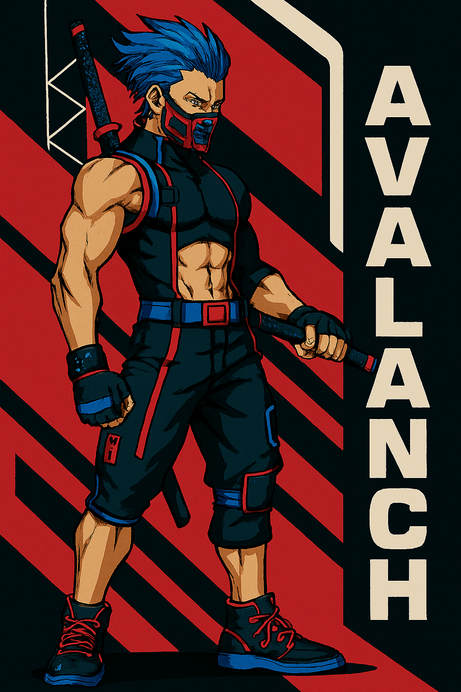
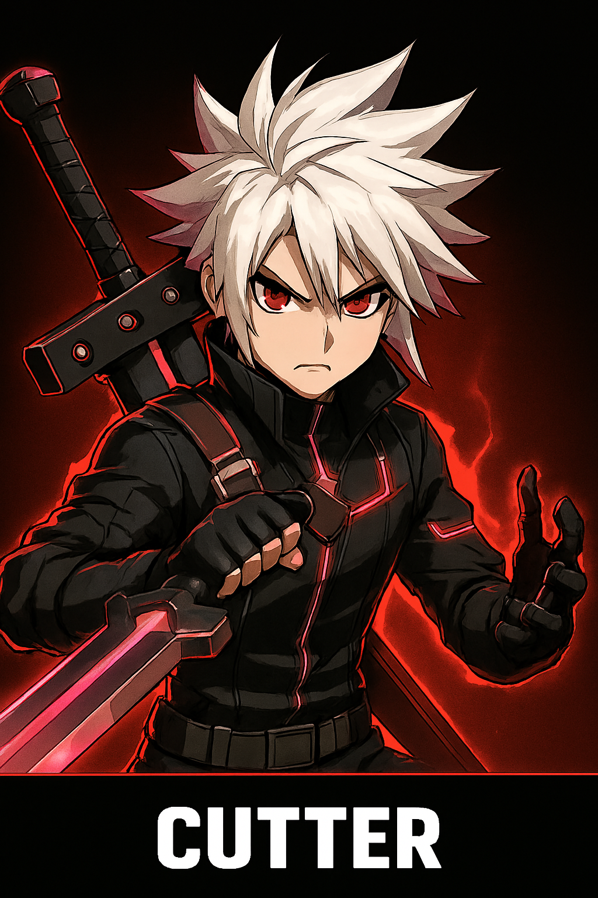
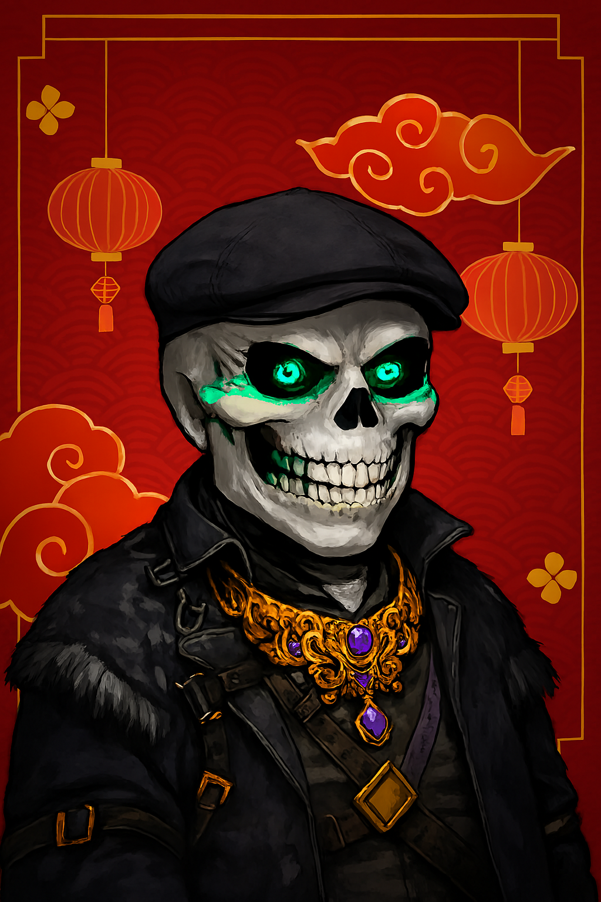
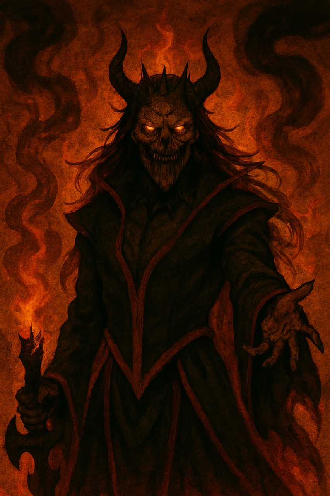
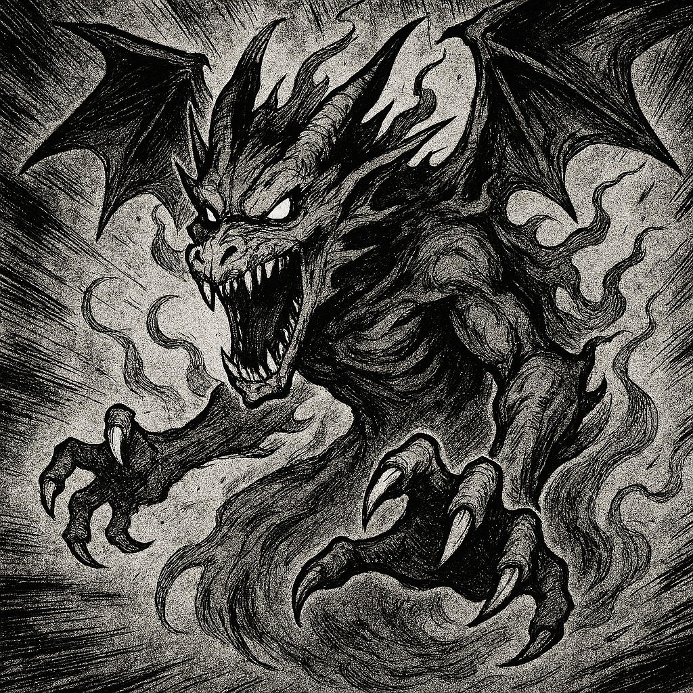
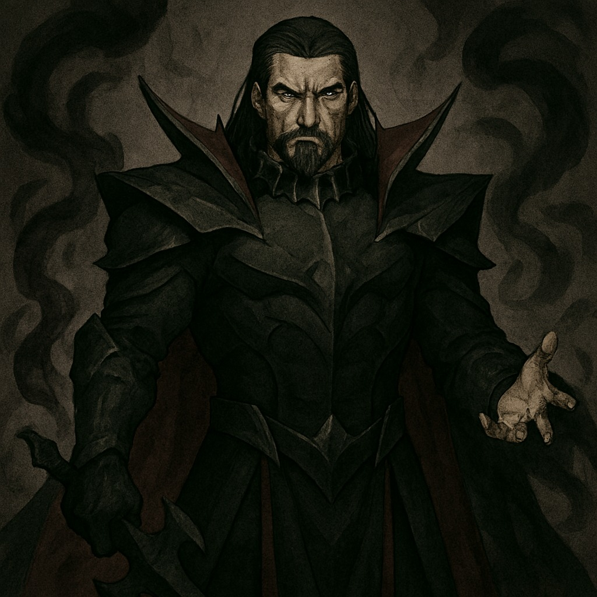
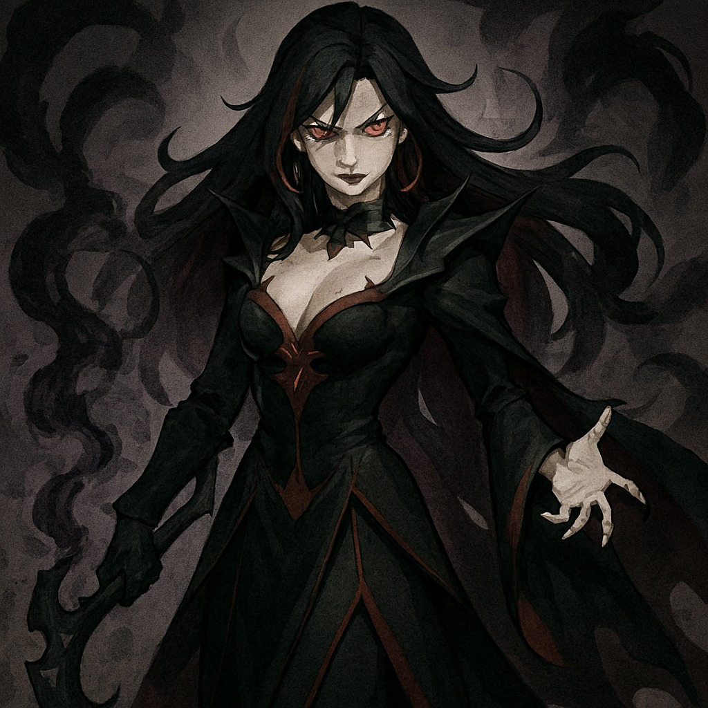

<div align="center">

# AVALORA - Shiro no Kizuna
### Bonds of the White Snow



[](https://nextjs.org/)
[](https://www.typescriptlang.org/)
[](https://reactjs.org/)
[](https://tailwindcss.com/)
[](https://www.framer.com/motion/)
[](https://greensock.com/gsap/)

*A browser-based anime/manga-styled adventure game built around the Avalanche blockchain*

[🎮 Play Now](#getting-started) • [📖 Documentation](#documentation) • [🎨 Features](#features) • [🚀 Deployment](#deployment)

</div>

---

## 🌟 Overview

**AVALORA** is an immersive browser-based adventure game that combines the captivating aesthetics of anime and manga with cutting-edge Web3 technology. Set in the mystical Avalanche realm, players embark on epic quests, master typing challenges, and learn about blockchain technology while earning gems and cosmetics.

### 🎯 Core Concept

Players progress through comic-inspired story chapters, defeat enemies via typing challenges and Web3 quizzes, and earn gems that can be exchanged for AVAX tokens. The game seamlessly blends entertainment with education, making blockchain technology accessible through engaging gameplay.

---

## ✨ Features

### 🎮 **Gameplay Mechanics**
- **Epic Quest System**: Comic-style story chapters with immersive lore
- **Battle Encounters**: Typing challenges, word jumbles, and Web3 trivia
- **Character Progression**: Level up, earn XP, and collect gems
- **Training Grounds**: Practice typing skills and learn blockchain concepts
- **Achievement System**: Unlock badges and track your progress

### 🎨 **Visual Design**
- **Anime/Manga Aesthetic**: Authentic Japanese-inspired art style
- **Fluid Animations**: GSAP-powered scroll animations and transitions
- **Seamless Blending**: Smooth transitions between sections
- **Floating Particles**: Dynamic background effects
- **Manga Borders**: Comic-book style UI elements

### 🌐 **Web3 Integration**
- **Wallet Connect**: MetaMask integration (expandable)
- **Gem Economy**: In-game currency system
- **NFT Marketplace**: Trade cosmetics and rare items
- **Avalanche Education**: Learn about blockchain technology

### 🏆 **Social Features**
- **Global Leaderboards**: Compete with players worldwide
- **Profile Customization**: Personalize your character
- **Marketplace Trading**: Buy and sell cosmetic items
- **Achievement Sharing**: Show off your accomplishments

---

## 🎭 Characters

### 👑 **Main Characters**

<div align="center">

<table>
<tr>
<td align="center" width="200">

<br><b>AVAXIM</b><br>
<i>Emperor of AVALAND</i><br>
⚡ Lightning Element<br>
<small>Supreme ruler with unmatched blockchain mastery</small>
</td>
<td align="center" width="200">

<br><b>AVALANCH</b><br>
<i>Ambassador of AVALORA</i><br>
❄️ Ice Element<br>
<small>Trusted guide between mortal and digital realms</small>
</td>
</tr>
<tr>
<td align="center" width="200">

<br><b>Cutter</b><br>
<i>Blade Master</i><br>
⚔️ Steel Element<br>
<small>Lightning-fast warrior with precision strikes</small>
</td>
<td align="center" width="200">

<br><b>Ghosty</b><br>
<i>Phantom Hacker</i><br>
🌙 Shadow Element<br>
<small>Mysterious entity phasing between realms</small>
</td>
</tr>
</table>

</div>

### 😈 **Villains & Threats**

The realm faces constant threats from the **Meron Forces** - dark entities seeking to corrupt the network:

<div align="center">

<table>
<tr>
<td align="center" width="200">

<br><b>Meron Devil</b><br>
<i>Chaos Bringer</i><br>
🔥 Corruption Element
</td>
<td align="center" width="200">

<br><b>Meron Dragon</b><br>
<i>Ancient Terror</i><br>
🐉 Destruction Element
</td>
</tr>
<tr>
<td align="center" width="200">

<br><b>Meron Emperor</b><br>
<i>Dark Ruler</i><br>
👑 Dominion Element
</td>
<td align="center" width="200">

<br><b>Meron Witch</b><br>
<i>Spell Weaver</i><br>
🔮 Dark Magic Element
</td>
</tr>
</table>

</div>

---

## 🛠 Tech Stack

### **Frontend Framework**
- **Next.js 14**: React framework with App Router
- **TypeScript**: Type-safe development
- **React 18**: Modern React with concurrent features

### **Styling & Animation**
- **Tailwind CSS**: Utility-first CSS framework
- **Framer Motion**: Smooth page transitions and animations
- **GSAP**: Advanced scroll-triggered animations
- **Custom CSS**: Manga-style borders and effects

### **State Management**
- **React Context**: Global game state management
- **Local Storage**: Persistent player data

### **Development Tools**
- **ESLint**: Code linting and formatting
- **PostCSS**: CSS processing and optimization
- **Autoprefixer**: CSS vendor prefixing

---

## 🚀 Getting Started

### Prerequisites
- **Node.js** 18.0 or higher
- **npm** or **yarn** package manager

### Installation

1. **Clone the repository**
   ```bash
   git clone https://github.com/jishanahmed-shaikh/avalora.git
   cd AVALORA
   ```

2. **Install dependencies**
   ```bash
   npm install
   # or
   yarn install
   ```

3. **Run the development server**
   ```bash
   npm run dev
   # or
   yarn dev
   ```

4. **Open your browser**
   Navigate to [http://localhost:3000](http://localhost:3000)

### Build for Production

```bash
npm run build
npm start
```

---

## 🎯 User Journey

### 1. **Landing Experience**
- **Hero Section**: Immersive video background with AVALORA logo
- **Smooth Scrolling**: GSAP-powered section transitions
- **Character Showcase**: Meet the legendary heroes and villains
- **Lore Introduction**: Discover the Avalanche realm's rich history

### 2. **Authentication**
- **Anime-styled Modal**: Beautiful login/signup interface
- **Wallet Integration**: Connect with MetaMask (mock implementation)
- **Smooth Transitions**: Anime-themed page transitions

### 3. **Game Hub (Dashboard)**
- **Player Stats**: Level, HP, gems, and XP tracking
- **Quick Navigation**: Access all game features
- **Recent Activity**: Track your progress and achievements
- **Dynamic Background**: Floating particles and animations

### 4. **Quest System**
- **Comic Panels**: Story introduction before battles
- **Battle Types**: 
  - Typing challenges (speed and accuracy)
  - Word jumble puzzles
  - Web3/Avalanche trivia
- **Reward System**: Earn gems and XP for victories
- **Consequence System**: Lose HP for defeats

### 5. **Training Grounds**
- **Typing Practice**: Improve WPM and accuracy
- **Web3 Education**: Learn about Avalanche and blockchain
- **Progress Tracking**: Monitor skill development

### 6. **Marketplace**
- **Item Categories**: Avatars, weapons, accessories, backgrounds
- **Rarity System**: Common, Rare, Epic, Legendary
- **Gem Economy**: Purchase items with earned gems
- **Visual Previews**: High-quality item showcases

---

## 🎨 Design Philosophy

### **Anime/Manga Aesthetic**
- **Visual Style**: Inspired by popular anime and manga
- **Color Palette**: Avalanche red (#E84142) with black/white contrasts
- **Typography**: Japanese-inspired fonts (Orbitron, Noto Sans JP)
- **UI Elements**: Manga borders, speech bubbles, and comic panels

### **User Experience**
- **Fluid Transitions**: Seamless page changes with anime effects
- **Responsive Design**: Optimized for all device sizes
- **Accessibility**: Keyboard navigation and screen reader support
- **Performance**: Optimized animations and lazy loading

---

## 📁 Project Structure

```
AVALORA/
├── app/                    # Next.js App Router
│   ├── auth/              # Authentication pages
│   ├── dashboard/         # Game hub
│   ├── quest/             # Battle system
│   ├── training/          # Skill development
│   ├── marketplace/       # Item trading
│   ├── leaderboard/       # Global rankings
│   ├── profile/           # Character customization
│   ├── globals.css        # Global styles
│   ├── layout.tsx         # Root layout
│   ├── page.tsx           # Landing page
│   └── providers.tsx      # Context providers
├── components/            # Reusable components
│   ├── landing/           # Landing page sections
│   ├── FloatingParticles.tsx
│   ├── PageTransition.tsx
│   └── WhirlpoolButton.tsx
├── public/                # Static assets
│   ├── Artworks-Characters/
│   ├── BadgeAssets/
│   ├── ImageAssets/
│   ├── LogoAssets/
│   ├── VideoAssets/
│   ├── VillainAssets/
│   └── WebsiteAssets/
└── README.md
```

---

## 🔮 Future Roadmap

### **Phase 1: Core Enhancement**
- [ ] Advanced battle mechanics
- [ ] More character classes
- [ ] Extended story chapters
- [ ] Mobile app development

### **Phase 2: Web3 Integration**
- [ ] Real Avalanche network integration
- [ ] NFT marketplace deployment
- [ ] AVAX token integration
- [ ] Smart contract development

### **Phase 3: Community Features**
- [ ] Guild system
- [ ] Multiplayer battles
- [ ] Tournament mode
- [ ] Social features expansion

### **Phase 4: Platform Expansion**
- [ ] Mobile applications
- [ ] VR/AR integration
- [ ] Cross-platform play
- [ ] Esports tournaments

---

## 🤝 Contributing

We welcome contributions from the community! Please read our [Contributing Guidelines](CONTRIBUTING.md) before submitting pull requests.

### Development Setup
1. Fork the repository
2. Create a feature branch
3. Make your changes
4. Test thoroughly
5. Submit a pull request

---

## 📄 License

This project is licensed under the MIT License - see the [LICENSE](LICENSE) file for details.

---

## 🙏 Acknowledgments

- **Avalanche Team** for blockchain inspiration
- **Anime/Manga Community** for artistic inspiration
- **Open Source Contributors** for amazing tools and libraries
- **Gaming Community** for feedback and support

---

<div align="center">

### Ready to embark on your adventure in the Avalanche realm?

**The bonds of the white snow await your mastery!** ❄️⚔️

[🎮 **Start Your Journey**](http://localhost:3000) • [📧 **Contact Us**](mailto:team@avalora.game) • [🐦 **Follow Us**](https://twitter.com/avalora_game)

---

*Made with ❤️ by the AVALORA Team*

</div>